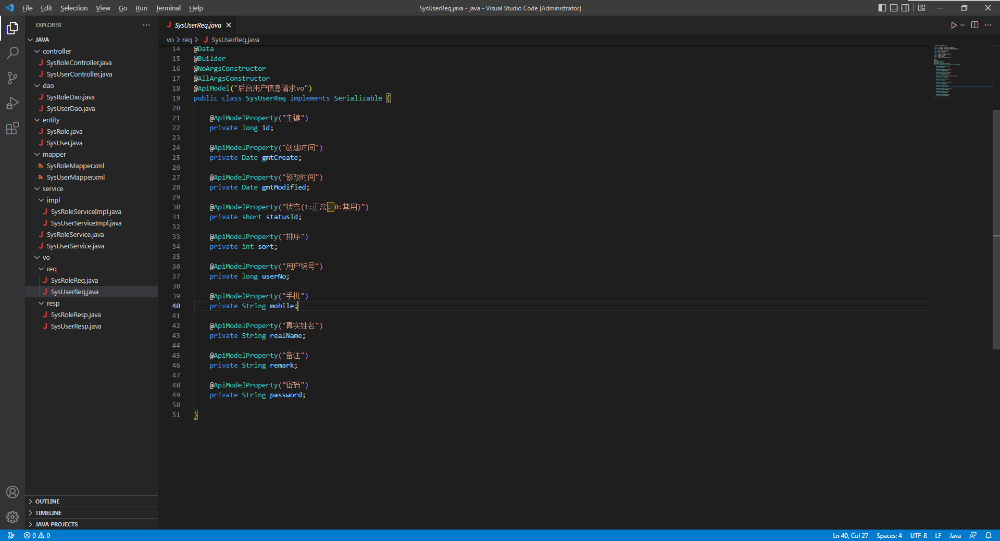

   
  <h1>Code Desktop</h1>
  <strong>生成模板代码 减少重复工作</strong>

code desktop 是一款java mybtis模板代码生成工具,由于平时java开发流程大多数都是先建数据库表--> entity --> dao -->mapper -->service-->impl--->vo--->-->swagger-->
controller这个流程固定又重复的操作，code desktop它能帮助开发者简化上面的流程，直接生成模板代码

# 1.安装方式

## 1.1 源码编译安装

下载代码 git clone https://github.com/feihua/code-desktop.git

编译项目npm install

运行项目 npm run tauri dev

打包项目 npm run tauri build

## 1.2 直接下载二进制文件

https://github.com/feihua/code-desktop/releases/download/0.1/code-desktop-x64-v0.1-win.zip

解压后，直接双击运行即可

# 2.使用

生成的代码目录结构：

